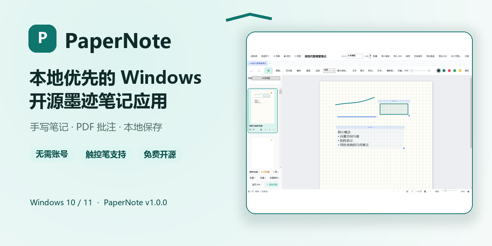
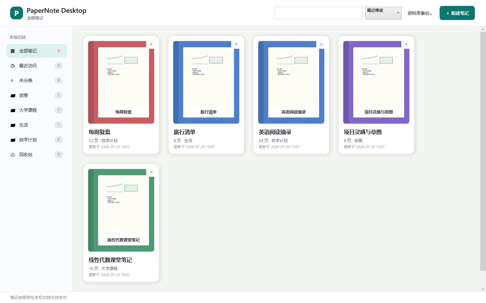
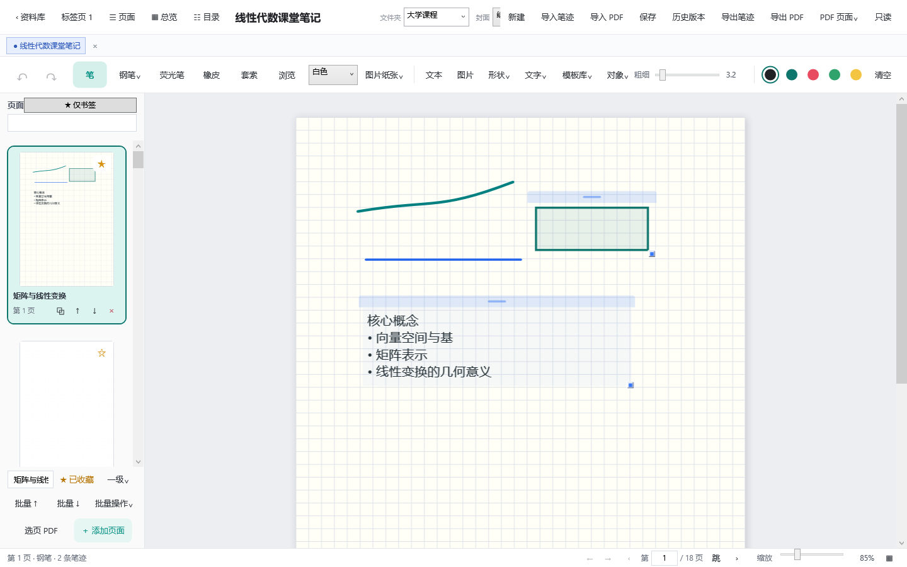

<div align="center">

# PaperNote

### 本地优先的 Windows 开源墨迹笔记应用

无需账号 · 无需订阅 · 本地保存 · PDF 批注 · 触控笔支持

[](https://github.com/Jiejie-Tech/PaperNote/releases/latest)
[](https://gitee.com/aa20234350104/paper-note)

[](https://github.com/Jiejie-Tech/PaperNote/releases/latest)
[](LICENSE)




</div>

PaperNote Desktop 面向 Windows 笔记本电脑、触控设备和数位板，围绕手写、分页、纸张模板、PDF 批注和本地资料库提供完整的单机工作流。核心笔记数据默认保存在本机，不依赖账号、订阅或云服务。

<div align="center">


[观看 45 秒完整演示视频](videos/papernote-promo/renders/papernote-promo.mp4)

</div>

> 当前公开版本：**v1.0.0** · 数据格式版本：**13** · 提供 Windows 64 位便携版

## 为什么选择 PaperNote

| 本地优先 | 为 Windows 书写而生 | 完整笔记流程 |
| --- | --- | --- |
| 无需登录，核心数据默认保存在自己的电脑上 | 支持触控笔、数位板和鼠标，提供多笔型、压感和平滑设置 | 从资料库、分页、书签和目录，到 PDF 批注、历史版本与导出 |

## 界面预览

<table>
<tr>
<td width="50%"><br><b>本地资料库</b>：分类、文件夹、封面、搜索和回收站</td>
<td width="50%"><br><b>笔记编辑器</b>：手写、分页、模板、对象和 PDF 批注</td>
</tr>
</table>

## 核心能力

- **自然书写**：圆珠笔、钢笔、画笔、铅笔、荧光笔、压感和平滑设置。
- **灵活纸张**：空白、点阵、横线、方格纸、图片纸张和共享模板。
- **页面组织**：缩略图、标题、书签、目录、页面总览和批量操作。
- **PDF 批注**：按页码导入、旋转、裁边、书写批注并重新导出 PDF。
- **丰富对象**：文本、图片、矩形、圆形、箭头、直线和混合套索。
- **数据保护**：自动保存、历史版本、恢复前保护点和整库备份恢复。
- **本地检索**：跨笔记搜索标题、文字对象和来源元数据。
- **离线使用**：不要求账号，不主动上传笔记内容。

完整功能请查看 [功能清单](docs/FEATURES.md)。

## 下载和开始使用

1. 打开 [最新发行版](https://github.com/Jiejie-Tech/PaperNote/releases/latest)。
2. 下载 `PaperNote-Desktop-1.0.0-win-x64.zip`。
3. 完整解压后双击 `PaperNote.Desktop.exe`。

系统要求：**Windows 10/11 64 位**。

v1.0.0 安装包 SHA256：

```text
8BA33FAC0E5560EC59F3D43A7F4E5D98AF52A7556C57D3DC2CEA5C98109F9AD4
```

详细操作、数据位置和常见问题见 [快速使用指南](docs/USER-GUIDE.md)。

## 数据和隐私

默认数据位置：

```text
文档\PaperNote\Notebooks   # 正式 .papernote 笔记本
文档\PaperNote\Backups     # 自动和手动历史版本
本地应用数据\PaperNote      # 标签、排序和共享模板设置
```

笔记本使用本地 `.papernote` 文件保存。PaperNote 默认不要求账号，也不主动上传笔记内容。更多说明见 [隐私说明](PRIVACY.md) 和 [安全政策](SECURITY.md)。

## 当前范围

PaperNote 当前专注于稳定、可控的单机离线体验，暂不提供账号、云同步、多人在线协作和手写 OCR。具体计划见 [项目路线图](ROADMAP.md)，版本变化见 [更新日志](CHANGELOG.md)。

## 从源码运行

环境要求：Windows 10/11、.NET 9 SDK。

```powershell
dotnet run --project ./src/PaperNote.Desktop/PaperNote.Desktop.csproj
```

## 后台测试

测试不会操控鼠标和键盘，也不会打开可见的 PaperNote 主窗口；测试数据写入系统临时目录，不会读取或修改正式笔记。

```powershell
./scripts/test.ps1
```

## 项目文档

- [快速使用指南](docs/USER-GUIDE.md)
- [完整功能清单](docs/FEATURES.md)
- [项目路线图](ROADMAP.md)
- [更新日志](CHANGELOG.md)
- [产品与开发方案](docs/PaperNote产品与开发方案.md)
- [贡献指南](CONTRIBUTING.md)
- [支持与反馈](SUPPORT.md)

## 参与贡献

欢迎提交问题、改进文档或贡献代码。开始前请阅读 [CONTRIBUTING.md](CONTRIBUTING.md) 和 [CODE_OF_CONDUCT.md](CODE_OF_CONDUCT.md)。

## 开源许可证

PaperNote Desktop 使用 [MIT License](LICENSE)。第三方组件仍适用各自许可证，详见 [THIRD-PARTY-NOTICES.md](THIRD-PARTY-NOTICES.md) 和 `legal/third-party/`。