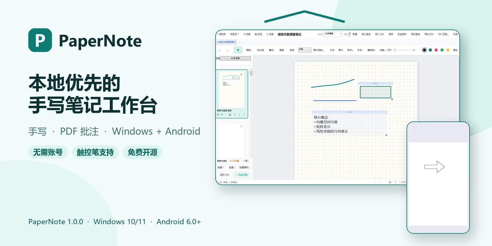
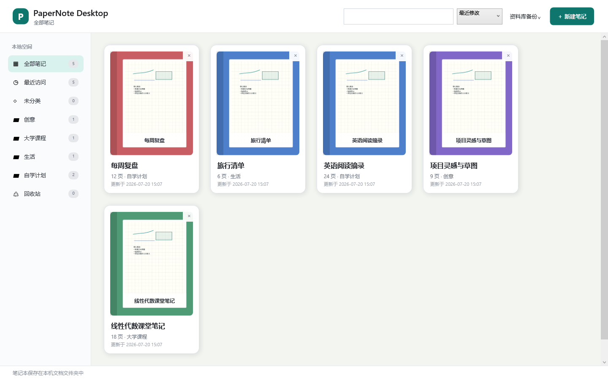
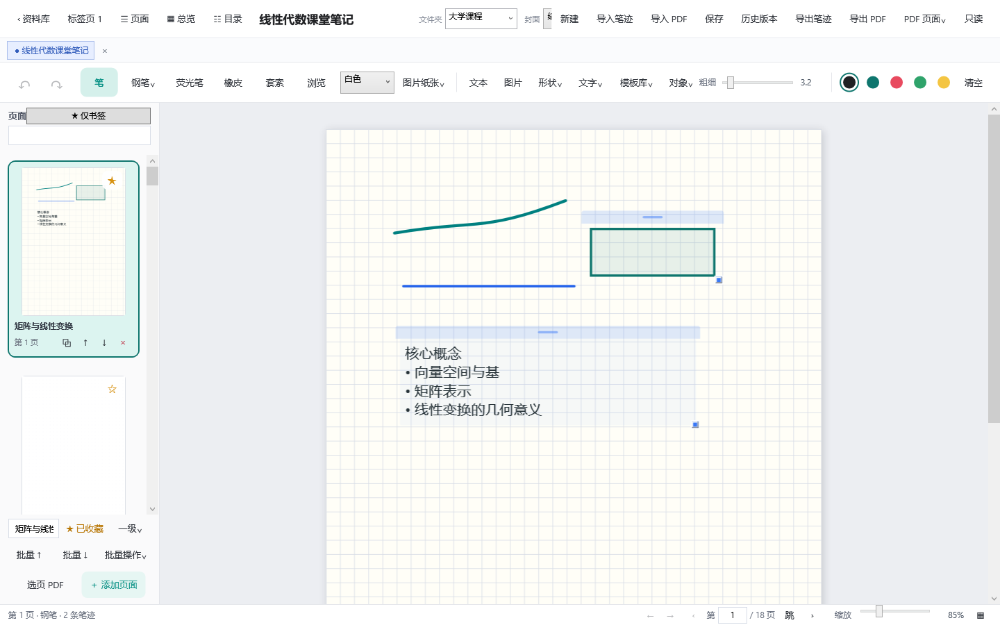
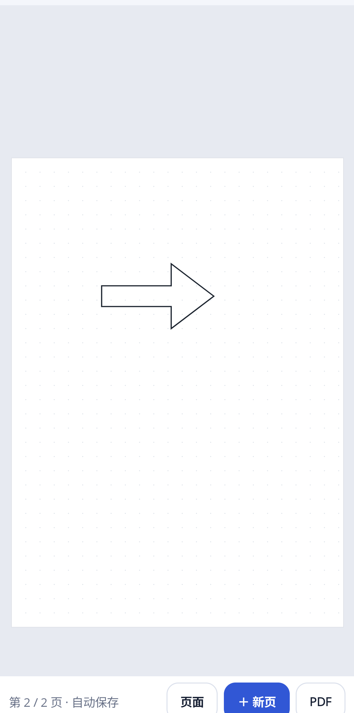

<div align="center">


# PaperNote

### 把手写、讲义和灵感，安静地留在自己的设备里

面向 Windows 笔记本电脑、触控设备和 Android 手机/平板的本地优先手写笔记应用。

<p>
  
  
  
  
</p>

**[GitHub 下载](https://github.com/Jiejie-Tech/PaperNote/releases)** · **[Gitee 下载](https://gitee.com/aa20234350104/paper-note/releases)** · **[使用指南](docs/USER-GUIDE.md)** · **[功能全览](docs/FEATURES.md)**

</div>



## 一个更专注的数字笔记工作台

PaperNote 把资料库、分页纸张、自然手写和 PDF 批注放在同一个工作区里。无需注册账号，打开应用就能开始记录；笔记默认保存在设备本地，也可以通过 `.papernote` 文件、导出文件和整库备份在电脑与 Android 设备之间传递。

| ✍️ 自然书写 | 📚 分页整理 | 📄 PDF 批注 |
| --- | --- | --- |
| 钢笔、荧光笔、压力输入、倾角采样、整笔/局部橡皮擦、图层与撤销重做。 | 新建、复制、删除、重命名、缩略图跳转和多种纸张模板。 | 按页码范围异步导入 PDF，离线搜索原文、浏览目录与内部链接、管理批注和评论，并导出或提取指定页面。 |
| **🧩 丰富内容** | **💻 Windows + Android** | **🔒 本地优先** |
| 文本、图片、直线、箭头、矩形、圆形、三角形、菱形和星形。 | 桌面端适配鼠标、触控和数位笔；移动端适配手机、平板与触控笔。 | 不要求账号，不包含广告和遥测；Android 客户端不申请网络权限。 |

## 产品实拍

### Windows 资料库

集中管理最近笔记、搜索结果、回收站和本地文件，让桌面上的资料保持清晰。



### Windows 编辑器

在宽屏工作区中同时使用手写、页面管理、文本、图片、形状和 PDF 批注工具；“PDF 学习”面板集中提供文本搜索、目录、内部链接和批注列表。



### Android 手机与平板

移动端保留完整的核心书写与学习流程：手机端默认可直接用手指书写，两排固定工具栏显示钢笔、荧光笔、橡皮擦、平移、粗细、颜色、手指开关、撤销和重做；“PDF”菜单提供文本搜索、书签/大纲、内部链接、批注列表、页面批量管理、范围导出和范围提取。应用同时支持触控笔、双指缩放、对象编辑、图层、直线/矩形/椭圆几何规整、混合选区 PNG 分享、本地录音波形与播放笔迹高亮、恢复中心、导入导出和备份。大笔迹页面按当前视口绘制，减少无关笔迹扫描。

<p align="center">
  
</p>

## 适合这些场景

- **课堂与自习**：按课程建立笔记本，在讲义或 PDF 上直接标记重点。
- **会议与项目**：用分页整理讨论记录、草图、流程和后续事项。
- **数位板书写**：在 Windows 笔记本或台式机上使用数位笔完成长时间记录。
- **跨设备阅读**：把 `.papernote` 文件传到 Android 手机或平板，继续查看和编辑。
- **离线资料管理**：不依赖账号或内置云服务，自行决定文件和备份放在哪里。


### 离线精细编辑与课堂回放

- Windows 与 Android 共用几何规整：可把接近直线的笔迹吸附到直线或 45° 方向，并识别规整矩形、椭圆。
- 混合套索选中的笔迹、文字、图片和形状可裁剪导出为白底 PNG；Android 通过系统分享保存或发送。
- Windows 在 WAV 保存后离线分析波形；Android 录音期间直接采集本机麦克风振幅。波形最多保存 2048 个归一化峰值，不依赖网络。
- 回放录音时会按照时间标记高亮当时关联的笔迹，并可从开头、25%、50%、75% 快速跳转。

## 下载与安装

| 平台 | 系统要求 | 获取方式 | 安装说明 |
| --- | --- | --- | --- |
| Windows | Windows 10/11 x64 | [GitHub Releases](https://github.com/Jiejie-Tech/PaperNote/releases) / [Gitee Releases](https://gitee.com/aa20234350104/paper-note/releases) | 下载 Windows 压缩包，解压后运行 `PaperNote.Desktop.exe`。 |
| Android | Android 6.0（API 23）及以上 | [GitHub Releases](https://github.com/Jiejie-Tech/PaperNote/releases) / [Gitee Releases](https://gitee.com/aa20234350104/paper-note/releases) | 推荐下载 Android ZIP，解压后安装其中的 APK；也可直接下载 APK。仅为当前文件来源临时授权“安装未知应用”。 |

> 正式安装包应从 Releases 页面获取。下载后可结合发布页提供的 SHA-256 校验值确认文件完整性。

Android 的权限、手势、导入导出和卸载前备份说明见 [Android 使用指南](docs/ANDROID.md)。

## 数据属于你

- 笔记默认保存在设备本地，无需创建账户。
- 单个笔记本使用开放归档结构的 `.papernote` 文件。
- Windows 和 Android 共用 PaperInk 墨迹与页面对象模型。
- 支持单笔记导入导出、指定页面提取、带 SHA-256 校验的整库备份与恢复。
- PDF 文本、原目录、内部链接和文字评论与页面一起保存在 `.papernote`，无需联网。
- 启动时可恢复较新的临时草稿；恢复中心可以另存损坏文件中的可读内容且不覆盖原文件。
- 录音附件与笔记一起留在本地资料库，并纳入整库备份；波形只在本机提取或采样，播放时可高亮关联笔迹。
- Android 应用私有数据会随卸载被系统删除，卸载前请先导出或备份。
- 当前不提供内置云同步；你可以自行使用网盘、数据线或局域网工具传递文件。

更多兼容性细节见 [数据格式说明](docs/DATA-FORMAT.md)，隐私承诺见 [隐私说明](PRIVACY.md)。

## 文档中心

| 文档 | 内容 |
| --- | --- |
| [用户指南](docs/USER-GUIDE.md) | Windows 与 Android 的资料库、编辑器、页面、PDF、搜索与备份操作 |
| [Android 指南](docs/ANDROID.md) | 安装、权限、手势、文件传递和数据安全 |
| [功能全览](docs/FEATURES.md) | 当前已经实现的功能与尚未包含的能力 |
| [数据格式](docs/DATA-FORMAT.md) | `.papernote`、PaperInk、备份格式和跨平台兼容性 |
| [Android 构建](docs/BUILD-ANDROID.md) | Android 开发环境、编译、签名和设备测试 |
| [发布指南](docs/RELEASE.md) | Windows 与 Android 安装包的验证和发布流程 |
| [开发路线](ROADMAP.md) | 后续版本方向与优先级 |
| [参与贡献](CONTRIBUTING.md) | 开发约定、提交要求和协作方式 |

<details>
<summary><strong>从源码构建</strong></summary>

### 环境要求

- Windows 10/11
- .NET SDK `10.0.302`
- 构建 Android 客户端时需要对应的 .NET for Android / MAUI 工作负载与 Android SDK

### 获取与验证

```powershell
git clone https://github.com/Jiejie-Tech/PaperNote.git
cd PaperNote
dotnet restore PaperNote.sln
.\scripts\test.ps1 -SkipAndroidRuntime
```

有可用 Android 模拟器或设备时，可运行完整后台验证：

```powershell
.\scripts\test.ps1
```

生成 Windows 发布包、Android ZIP/APK 和签名文件前，请阅读 [发布指南](docs/RELEASE.md)。密钥、密码、真实笔记和构建产物不得提交到仓库。

</details>

## 参与 PaperNote

欢迎提交问题、改进文档或贡献代码。在开始较大的功能改动前，建议先阅读 [贡献指南](CONTRIBUTING.md) 和 [开发路线](ROADMAP.md)，并通过 Issue 说明使用场景和预期行为。

如果 PaperNote 对你有帮助，欢迎点亮 Star，让更多需要本地手写笔记的人发现它。

## 许可

PaperNote 使用 [MIT License](LICENSE) 开源。第三方组件及字体许可见 [THIRD-PARTY-NOTICES.md](THIRD-PARTY-NOTICES.md)。

## Implementation status — 2026-07-23

本节是当前离线版本能力边界的统一说明。

### 已实现并纳入仓库测试

- Windows 与 Android 共用 PaperInk 和页面对象模型；支持压力、倾角、平滑、整笔/局部擦除、透明度、图层及自由形状混合套索。
- 页面支持复制、删除、移动到开头/末尾、书签、PDF 背景旋转，以及按页码范围导出 PDF 或提取为新的 `.papernote`；提取时会生成新 ID 并重映射保留下来的内部链接。
- Windows 与 Android 的 PDF 导入支持 200 MB/500 页边界、逐页进度、取消、完整 SHA-256 内容指纹缓存、失败续接和旧缓存清理；原 PDF 始终不被修改。
- 对带文本层的 PDF，会在本机离线提取并保存页面文本、原 PDF 目录/书签和内部 GoTo 链接；Windows 与 Android 均可搜索文本、浏览目录并跳转到已导入的目标页。
- PDF 学习工作流包含统一批注列表、类型/颜色筛选和页面文字评论；评论、PDF 文本、目录和链接都保存在 `.papernote` 中，可随 Windows/Android 文件往返。
- 离线搜索覆盖笔记/页面标题、标签、文本对象、PDF 文本、文字评论、来源名称以及已保存的 OCR/手写识别结果。
- 保存采用“临时文件写入并验证后替换”；Windows 与 Android 均提供恢复中心、只读损坏检查和另存抢救副本。
- 整库备份格式 3 包含笔记、历史版本和音频附件，并校验长度与 SHA-256；页面级本地录音支持播放、暂停、重命名、删除、时间标记、本地波形、分段跳转和播放笔迹高亮。
- 当前 `.papernote` 数据格式版本为 17；加载器会修复常见无效 ID、坐标、图层引用、链接、目录、评论和波形数据。
- 后台回归覆盖 Core、真实 PDF 内容提取、格式 17 存储往返、几何规整、混合选区 PNG、录音波形、播放笔迹高亮、Windows 隐藏 UI、Android Release/AOT 与 APK 静态检查；测试过程不操控用户鼠标。

### 当前明确边界

- PDF 文本搜索依赖原文件自带文本层；扫描版 PDF 和图片尚未内置离线 OCR，因此只能作为页面图像批注。
- PDF 内部链接只有目标页也已导入到当前笔记时才能跳转；未导入目标会明确提示。
- 当前可搜索 PDF 文本，但尚未提供逐字选择、复制原文或直接修改原 PDF 的“原生文本高亮”；高亮仍以 PaperNote 独立批注保存。
- 尚未包含真正的离线 OCR、手写转文字、数学/LaTeX 识别、完整标尺和更高级的几何构造工具。
- 录音已包含本地波形、分段跳转和播放笔迹高亮；麦克风设备选择、质量设置及点击笔迹反向跳转仍待完善。
- PDF 可编辑表单、数字签名、测量、合并多个源 PDF、双页阅读和分屏仍未实现；200 MB/500 页边界仍需更多低内存 Android 真机长期压力验证。
- 完整屏幕阅读器语义、高对比度专项适配和本地插件机制仍待完善；笔记级本地密码保护已完成。
- 账号、云同步、联网 AI、遥测、广告和多人协作不在离线版本范围内。
- APK、ZIP、签名密钥、构建输出和私人笔记属于发布产物或本地数据，不提交到源码仓库。

### 验证入口

```powershell
.\scripts\test.ps1 -SkipAndroidRuntime
.\scripts\build-release.ps1 -SkipTests
.\scripts\build-android.ps1
.\scripts\test-android.ps1 -SkipBuild -SkipUi
```


## 本地密码保护（2026-07-23）

- Windows 与 Android 都可以为单个笔记本启用、更改或关闭密码保护。
- 加密容器为 `PNENC2`，正文使用 AES-GCM，加密密钥由 PBKDF2-SHA256（210,000 次）从至少 8 个字符的密码派生。
- 密码不会写入设置、笔记文件或日志；退出应用后再次打开需要重新输入，忘记后无法找回。
- 书架标题、文件夹、封面、页数、收藏/置顶和回收站状态保留为可见元数据，但会作为认证数据参与完整性校验；页面、笔迹、PDF 内容和录音信息全部加密。
- 自动保存、历史版本和整库备份均保持加密；历史版本支持跨越“启用保护/更改密码/关闭保护”的状态恢复。
- 文档内部格式仍为 `FormatVersion 17`，加密外壳单独版本化为 `PNENC2`；旧 `PNENC1` 文件仍可打开。

## 课堂与复习工具

Windows 与 Android 现已支持本地胶带遮挡、常用元素（重点、疑问、完成、星标、分隔线和公式框）、不写入笔记的激光笔与演示模式。录音期间书写的笔迹可反向跳转到对应时间点。
